# StockLift - AI-Powered Dead Stock Intelligence Platform

[](https://www.python.org/downloads/)
[](https://flask.palletsprojects.com/)
[](LICENSE)

> **Transform your inventory management with AI-driven insights, festival-based clearance strategies, and smart discount optimization.**

<p align="center">
  
</p>

---

## Features

| Feature                          | Description                                                                 |
|----------------------------------|-----------------------------------------------------------------------------|
| 🎯 **Smart Product Health Analysis** | AI-powered assessment using XGBoost models to classify products as Healthy, At Risk, or Dead Stock based on multiple factors. |
| 🌐 **Regional Festival Insights** | Location-specific festival dashboard with actionable analytics and sales opportunities for 100+ Indian cities. |
| 💰 **Intelligent Discount Calculator** | ML-driven pricing optimization considering product health, festival timing, and market trends. |
| 📦 **Bundle Recommendation Engine** | A cross-shopkeeper collaboration system for creating complementary product bundles and facilitating cost sharing. |
| 📸 **Photogenix AI** | Professional product photography enhancement with background removal, replacement, and auto-enhancement. |
| 🏪 **Shopkeeper Management** | Complete inventory tracking system with product history and performance analytics. |
| 🪄 **Campaign Generator** | Instantly create, download, or copy ready-to-use festival campaigns (banners, messages, offers) tailored to your shop and region. |


---

## Product Health Analysis

StockLift uses advanced machine learning to analyze product health and provide actionable insights.

**Health Categories:**
- 🟢 **Healthy** (Score: 0.7-1.0) - Products performing well
- 🟡 **At Risk** (Score: 0.4-0.7) - Products needing attention  
- 🔴 **Dead Stock** (Score: 0.0-0.4) - Products requiring immediate action

**Analysis Factors:**
- Days in stock
- Price depreciation trends
- Demand patterns
- Seasonality factors
- Quantity levels

## Festival-Based Clearance Engine

Comprehensive festival database covering:

| Festival Type | Examples |
|---------------|----------|
| **National Festivals** | Diwali, Holi, Raksha Bandhan, Eid |
| **Regional Festivals** | Pongal, Onam, Bihu, Lohri |
| **Seasonal Events** | Wedding season, Back-to-school, Monsoon sales |
| **Cultural Events** | College fests, Sports events, Office parties |

**Features:**
- Product-festival relevance mapping
- Demand boost predictions
- Marketing opportunity identification
- Trending style recommendations

# Photogenix AI - Product Photography Enhancement

<p align="center">
  
</p>

Transform your product images with AI-powered tools:

<div align="center">

| Tool | Description |
|------|-------------|
| **Background Removal** | AI-powered background elimination using U2Net |
| **Background Replacement** | Studio and lifestyle backgrounds with lighting matching |
| **Auto Enhancement** | Smart brightness and contrast adjustment |
| **Cropping & Resizing** | Platform-specific dimensions for Amazon, Flipkart, etc. |
| **Creative Content** | Marketplace-ready descriptions and attributes |

</div>
<br>
<p align="center">
  
</p>

---

## Project Structure

```
StockLift-ScriptedByHer/
├── app.py                 # Main Flask application
├── models/               # AI/ML models and business logic
│   ├── product_health.py      # Product health analyzer
│   ├── festival_engine.py     # Festival promotion engine
│   ├── discount_calculator.py # Smart discount calculator
│   ├── bundle_calculator.py   # Bundle recommendation engine
│   ├── location_service.py    # Location-based services
│   └── product_tracker.py     # Product tracking system
├── templates/            # HTML templates
│   ├── index.html            # Main dashboard
│   ├── shopkeeper_dashboard.html # Shopkeeper interface
│   └── indexphoto.html        # Photogenix AI interface
├── static/              # CSS, JS, and assets
│   ├── css/                 # Stylesheets
│   ├── js/                  # JavaScript files
│   ├── img/                 # Images and icons
│   └── backgrounds/         # Background images for Photogenix
├── u2net/              # Background removal AI model
├── uploads/            # File upload directory
├── processed/          # Processed images
└── exports/            # Data export files
```

---

## Application Flow (Overview)

```mermaid
flowchart TD
    A[StockLift]
    A --> B[Photogenix AI]
    A --> C[Dashboard]
    A --> D[Campaign Generator]

    %% Photogenix AI details
    B --> B1[Background Removal]
    B --> B2[Background Replacement]
    B --> B3[Auto Enhancement]
    B --> B4[Cropping & Resizing]
    B --> B5[Creative Content Generation]
    B1 --> B6[Enhanced Product Images]
    B2 --> B6
    B3 --> B6
    B4 --> B6
    B5 --> B6
    B6 --> B7[Optimized Product Listing]

    %% Dashboard details
    C --> C1[Smart Discount Calculator]
    C --> C2[Create Custom Bundle]
    C --> C3[Regional Festival Dashboard]
    C --> C4[Shopkeeper Dashboard]
    C1 --> C5[Product Health Analysis]
    C1 --> C6[Optimal Discount Recommendations]
    C2 --> C7[Bundle Suggestions]
    C2 --> C8[Collaboration]
    C3 --> C9[Festival Insights]
    C3 --> C10[Promotion Opportunities]
    C4 --> C11[Inventory Management]
    C4 --> C12[Sales Tracking]
    C4 --> C13[Analytics & Export]

    %% Campaign Generator details
    D --> D1[Generate Festival Campaigns]
    D --> D2[Download/Copy Campaigns]
    D --> D3[Personalized Banners & Messages]
    D1 --> D4[Select Festival & Region]
    D1 --> D5[Auto-generate Content]
    D3 --> D6[Ready-to-use Campaign Assets]
```



---

## Installation

Follow these steps to set up StockLift on your local machine:

### 1. **Clone the Repository**
```bash
git clone <repository-url>
cd StockLift-ScriptedByHer
```

### 2. **Set Up a Virtual Environment**
```bash
python -m venv venv

# On Windows
venv\Scripts\activate

# On macOS/Linux
source venv/bin/activate
```

### 3. **Install Dependencies**
```bash
pip install -r requirements.txt
```

### 4. **Configure Environment Variables**

**Using export command:**
```bash
export GOOGLE_API_KEY=your-google-api-key
```

**Or create a .env file:**
Create a `.env` file in the root directory:
```ini
GOOGLE_API_KEY=your-google-api-key
```

### 5. **Set Environment Variables**
```bash
export GOOGLE_API_KEY=your-google-api-key
```

### 6. **Run the Application**
```bash
python app.py
```

### 7. **Access the Application**
Open your browser and navigate to `http://localhost:5000`

---

### **API Endpoints (Collapsible, Grouped, with Tables)**

<details>
<summary><b>Product Analysis</b></summary>

| Endpoint                | Method | Description                                    |
|-------------------------|--------|------------------------------------------------|
| `/api/analyze-product`  | POST   | Analyze product health and get recommendations |
| `/api/health-stats`     | GET    | Get overall inventory health statistics        |
</details>

<details>
<summary><b>Festival Management</b></summary>

| Endpoint                          | Method | Description                                 |
|------------------------------------|--------|---------------------------------------------|
| `/api/festivals`                  | GET    | Get upcoming festivals for a location       |
| `/api/all-festivals`              | GET    | Get all festivals with details              |
| `/api/product-festival-opportunities` | POST | Get product-specific festival opportunities |
</details>

<details>
<summary><b>Bundle Management</b></summary>

| Endpoint                   | Method | Description                                 |
|----------------------------|--------|---------------------------------------------|
| `/api/create-bundle`       | POST   | Create custom bundles with multiple shopkeepers |
| `/api/bundle-recommendations` | POST | Get bundle suggestions for a product        |
</details>

<details>
<summary><b>Shopkeeper Management</b></summary>

| Endpoint                           | Method | Description                        |
|-------------------------------------|--------|------------------------------------|
| `/api/register-shopkeeper`          | POST   | Register new shopkeeper            |
| `/api/add-product`                  | POST   | Add new product to inventory       |
| `/api/record-sale-event`            | POST   | Record sale or restock events      |
| `/api/shopkeeper-products/<user_id>`| GET    | Get shopkeeper's product list      |
</details>

<details>
<summary><b>Image Processing (Photogenix AI)</b></summary>

| Endpoint                    | Method | Description                        |
|-----------------------------|--------|------------------------------------|
| `/process/background_removal` | POST | Remove image backgrounds           |
| `/process/enhance`            | POST | Enhance product images             |
| `/process/replace_background` | POST | Replace backgrounds                |
| `/process/crop_resize`        | POST | Crop and resize images             |
| `/process/make_professional`  | POST | Create professional product photos |
</details>

---

## Flow of the Application

### 1. **Product Health Analysis**
- User inputs product details (name, category, price, stock quantity, etc.)
- AI model analyzes health based on multiple factors
- System provides health score and status classification
- Recommendations are generated for improvement

### 2. **Festival-Based Clearance**
- System identifies upcoming festivals relevant to product category
- Calculates demand boost potential for each festival
- Suggests optimal timing for promotions
- Provides marketing opportunity insights

### 3. **Smart Discount Calculation**
- Analyzes product health score and festival timing
- Considers market competition and historical performance
- Generates optimal discount recommendations
- Calculates potential revenue impact

### 4. **Bundle Recommendations**
- Identifies complementary products from other shopkeepers
- Creates cost-effective bundle combinations
- Facilitates cross-shopkeeper collaboration
- Optimizes for festival-specific demand

### 5. **Photogenix AI Processing**
- User uploads product image
- AI removes background automatically
- System enhances image quality
- User can replace background or apply professional styling
- Final image is optimized for marketplace platforms

---

## Dashboard Features

### Main Dashboard
- Overall inventory health statistics
- Dead stock rescue potential (₹ value)
- Upcoming festival opportunities
- Real-time analytics and insights

### Shopkeeper Dashboard
- Product inventory management
- Sale event tracking and history
- Performance analytics and trends
- Data export capabilities

---

### **Technology Stack (Collapsible, with Table and Icon)**

<details open>
<summary><b>View Technology Stack</b></summary>

| Component            | Technology                        |
|----------------------|-----------------------------------|
| Backend Framework    | Flask (Python)                    |
| Frontend             | HTML5, CSS3, JavaScript           |
| Machine Learning     | XGBoost, Scikit-learn, TensorFlow |
| Image Processing     | U2Net (background removal)        |
| Database             | SQLite with pandas                |
| Deployment           | Local/Render.com                  |

</details>

---

## Prerequisites

- Python 3.8 or higher
- pip (Python package installer)
- Modern web browser
- 4GB+ RAM (for ML model processing)
- Google API key (for location services)

---

## Deployment

### Local Development
```bash
export GOOGLE_API_KEY=your-google-api-key
python app.py
```

### Deploying to Render.com

StockLift is ready for easy deployment on [Render.com](https://render.com). Follow these steps:

#### 1. Prepare Your Repository
- Ensure your repo contains:
  - `app.py` (Flask app)
  - `requirements.txt` (Python dependencies)
  - `models/` directory (with your ML model files)
  - `static/`, `templates/`, etc.

#### 2. Push to GitHub
- Commit and push all your code and model files to your GitHub repository.

#### 3. Create a New Web Service on Render
- Go to [render.com](https://render.com) and sign in with GitHub.
- Click **“New +”** → **“Web Service”**.
- Connect your GitHub repo and select your StockLift repository.

#### 4. Configure the Service
- **Name:** (Anything you like)
- **Branch:** `main` (or your default branch)
- **Build Command:** (leave blank; Render auto-installs from `requirements.txt`)
- **Start Command:**
  ```bash
  gunicorn app:app
  ```

#### 5. Set Environment Variables
- Click “Add Environment Variable”
- **Key:** `GOOGLE_API_KEY`
- **Value:** `your-google-api-key`

#### 6. Deploy
- Click **“Create Web Service”**
- Wait for the build and deploy to finish (a few minutes).

#### 7. Test Your App
- Visit the Render-provided URL (e.g., `https://stocklift.onrender.com`)
- Test all features, including ML model loading.

---

**Note:**
- Render allows much larger deployments than Vercel (GBs, not MBs).
- Your model files in the repo will be available to the app.
- The free tier may sleep after inactivity.
- Check the “Logs” tab in Render dashboard for errors.

---

**Quick Start for Local:**
```bash
export GOOGLE_API_KEY=your-google-api-key
python app.py
```

---

## What's Next for StockLift

| Feature | Description |
|---------|-------------|
| **Advanced ML Models** | Enhanced prediction accuracy with deep learning |
| **Real-time Notifications** | Push notifications for opportunities and alerts |
| **Mobile App** | Native mobile application for on-the-go management |
| **Integration APIs** | Connect with e-commerce platforms and marketplaces |
| **Advanced Analytics** | Predictive analytics and trend forecasting |


---

## License

This project is licensed under the MIT License - see the [LICENSE](LICENSE) file for details.

---

## Team

- Dimple Bhondekar
- Shreya Singh

## Acknowledgments

- U2Net for background removal capabilities
- Indian festival database contributors
- Open-source community for libraries and tools


## Version History

- **v1.0.0** - Initial release with core features
- **v1.1.0** - Added Photogenix AI
- **v1.2.0** - Enhanced festival engine
- **v1.3.0** - Improved ML models and UI

---

**Made with ❤️ for empowering shopkeepers worldwide**
